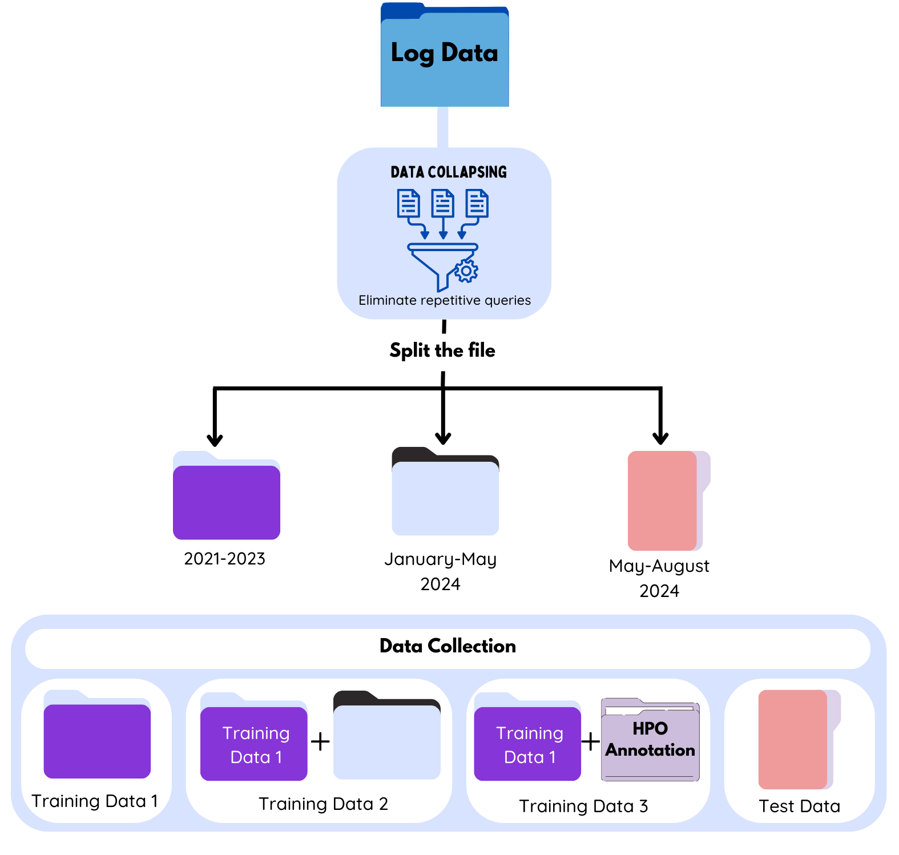
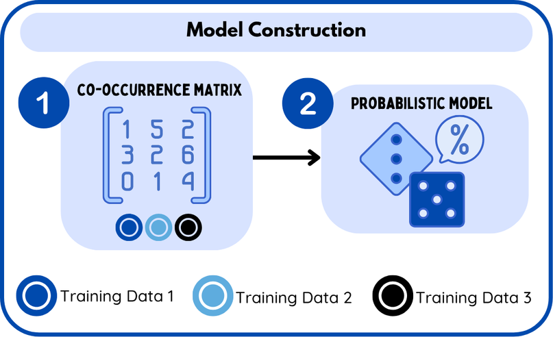
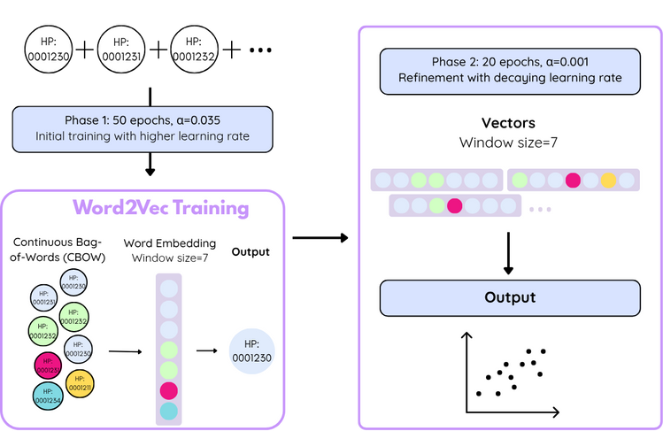
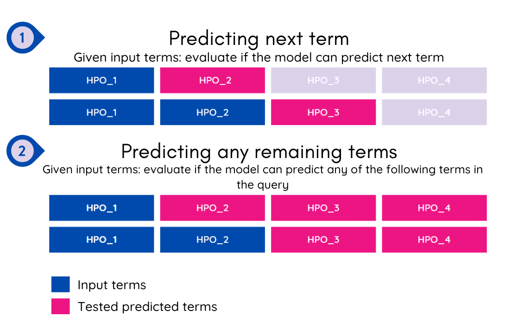
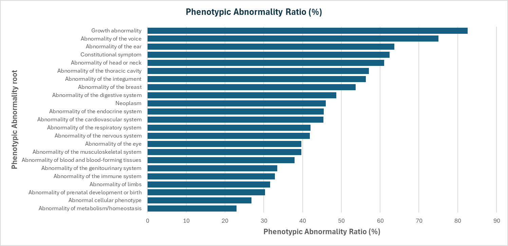
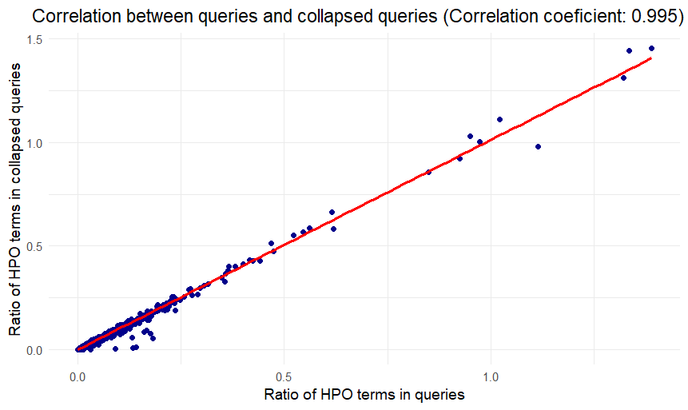
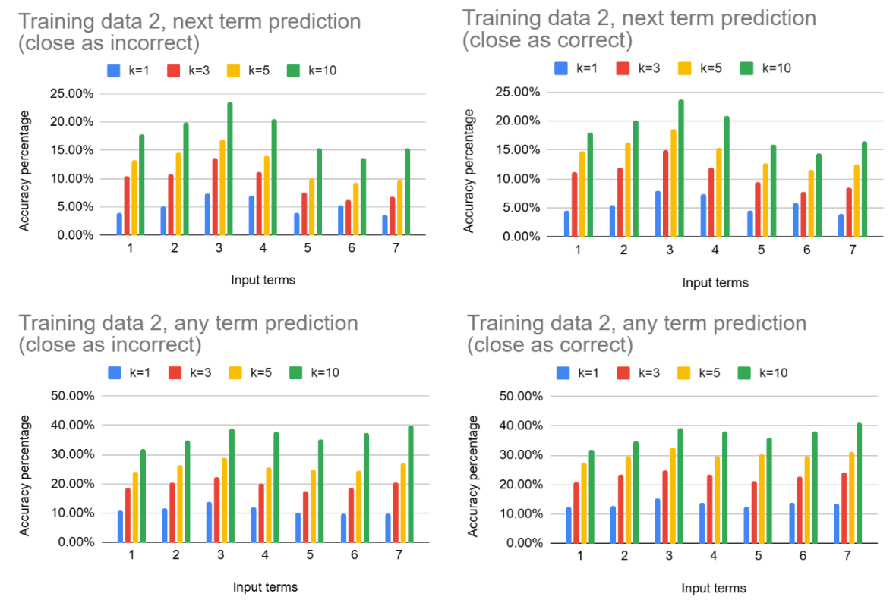
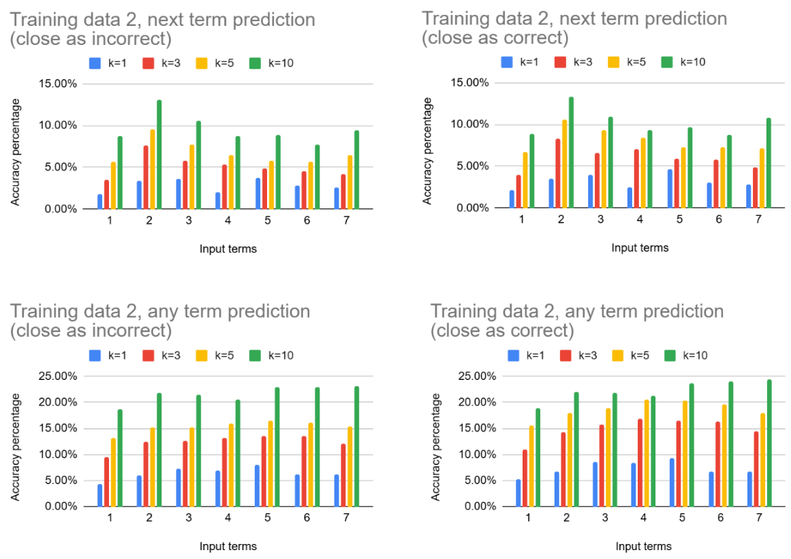

# Abstract

The Human Phenotype Ontology (HPO) has established itself as a crucial resource for researchers and clinicians in the rare disease field, offering a standardized vocabulary for over 8,000 phenotypic abnormalities since its introduction in 2008. Widely adopted for patient phenotyping, HPO enhances the accuracy of clinical descriptions, making it an integral component in the creation of patient profiles within registries. Its hierarchical structure and interoperability with other ontologies have expanded its utility in computational tools like PubCaseFinder and LIRICAL, which support differential diagnosis and variant identification. Despite HPO's widespread adoption, accurately identifying and recommending relevant phenotypes for deep phenotyping remains a significant challenge. To address this, we developed a tool that recommends HPO terms based on a co-occurrence matrix derived from seven years of PubCaseFinder queries, totaling approximately 80,000 searches. These queries, primarily from undiagnosed patients with suspected rare and genetic diseases, average 4.27 HPO terms per search, spanning from root to leaf terms. In this study, we split the search queries into training and test datasets to construct a co-occurrence matrix and evaluate the predictive accuracy of our tool. Our findings demonstrate that utilizing extensive HPO-based patient profiles from registries as training data significantly enhances the tool's accuracy. This tool, therefore, holds substantial potential for supporting deep phenotyping in various systems, contributing to more precise patient profiling and diagnosis, and ultimately improving patient outcomes.

# Introduction

The Human Phenotype Ontology (HPO) has become an indispensable resource for researchers and clinicians in the field of rare diseases. Since its introduction in 2008, HPO has grown to include a standardized vocabulary of phenotypic abnormalities associated with over 8,000 diseases [@citation:robinson2008human]. This comprehensive and well-defined set of terms has facilitated patient phenotyping, allowing for more accurate and detailed descriptions of clinical abnormalities [@citation:kohler2014human]. As a result, HPO has become the de facto standard for patient phenotyping in rare diseases, widely adopted by researchers, clinicians, informaticians, and patient registry systems globally [@citation:kohler2019expansion].

HPO's hierarchical organization and interoperability with other ontologies have significantly enhanced its utility in computational tools [@citation:kohler2019encoding]. By using HPO for creating patient profiles, patient repositories such as PhenomeCentral [@citation:buske2015phenomecentral] and IRUD [@citation:adachi2017japan], both participants in the Matchmaker Exchange project, facilitate the precise description and comparison of clinical features across patients [@citation:boycott2022seven]. PubCaseFinder, a phenotype-driven differential diagnosis tool, leverages HPO to generate ranked lists of rare diseases by comparing patient phenotypes with known disease profiles [@citation:fujiwara2018pubcasefinder]. Similarly, LIRICAL utilizes HPO terms to identify potential disease-causing variants from whole-exome or whole-genome sequencing data [@citation:robinson2020interpretable]. These systems underscore the critical role of HPO in modern medical research and diagnostics.

Despite the HPO’s success, one of the ongoing challenges in its application is the accurate and effective identification of patient's phenotypes for deep phenotyping [@citation:shen2017phenotypic; @citation:son2018deep; @citation:steinhaus2022deep; @citation:wang2022deep; @citation:havrilla2022phenominal]. The ability of deep phenotyping not only helps in creating a more complete patient profile but also enhances the accuracy of computational diagnostic tools that rely on phenotype-based comparisons [@citation:yuan2022evaluation].

To address this challenge, we developed a new tool designed to recommend HPO terms closely related to one or more given HPO terms. This tool recommends HPO terms based on a co-occurrence matrix of HPO terms, which was created from seven years' worth of queries consisting of combinations of HPO terms entered into PubCaseFinder [@citation:fujiwara2022advances]. For seven years, PubCaseFinder has processed approximately 80,000 searches, primarily consisting of phenotypes from undiagnosed patients suspected of having rare and genetic diseases. On average, each query includes 4.27 HPO terms, ranging from those near the root to leaf terms, covering a wide spectrum of HPO terms. In this study, we divided the search queries into training and test datasets, created a co-occurrence matrix using the training dataset, and demonstrated the predictive accuracy of our tool using the test dataset. We also show that by using the vast HPO-based patient profiles maintained by patient registries as training data, it is possible to build a more accurate tool. This tool facilitates more accurate and comprehensive deep phenotyping in many existing systems. This, in turn, can lead to more precise creating patient profiles and diagnoses, ultimately contributing to better patient outcomes.

# Method

## 1. Data Preprocessing

**Data Collection:**  

We employed two main data sources: PubCaseFinder query logs and annotations from the Human Phenotype Ontology (HPO). From the PubCaseFinder logs, we extracted 71,029 queries between June 8, 2021, and August 26, 2024. Additionally, we incorporated 12,629 HPO annotations related to rare diseases  [@citation:robinson2008human].

**Data Collapsing:**  
To eliminate biases due to user repetition, we conducted the following steps:

    - Find queries that start with the same N terms (N = 1 or 2)  
    - Then:  
        - Sort the lines  
        - Remove duplicates  
        - Remove prefix lines  

**Training Datasets:**  

   - For the training of our models, we used three different datasets:
        - Training dataset 1: collapsed file from 2021–2023.
        - Training dataset 2: Training dataset 1 + collapsed file from January 1, 2024 to May 2, 2024.
        - Training dataset 3: Training dataset 1 + HPO annotation file.

**Test Dataset:**  
We used queries from the collapsed file from May 2, 2024 to August 26, 2024.

## 2. Models employed

### Co-occurrence Analysis

### Word2Vec Model

The use of Word2Vec as a machine learning model has been extensively used in the field of Natural Language Processing (NLP), due to its performance in generating helpful relationships within words and classifying them using multiple degrees of similarity [@citation:mikolov2013efficient]. Word2Vec’s applications are various and have proven its value in the field of rare diseases by its capacity to capture relevant relationships from scientific literature and electronic health records (EHRs). With this information, it has been able to provide key advances that span from clinical diagnosis [@citation:gurbanli2025application] to drug discovery of rare diseases [@citation:ji2020literature]. 

Additionally, Word2vec has been tested using biomedical ontologies, including the Human Phenotype Ontology, to generate co-occurrence patterns between HPO terms and genetic disease information found on public databases like DECIPHER, OMIM, and Orphanet to generate a tool that can provide genotype-phenotype associations [@citation:shen2019hpo2vec].

For this work, we utilized Word2vec, implemented in the Gensim library, and treated the terms as a Continuous Bag-of-Words (CBOW) model. This means that the order in which the elements are provided for training does not impact the model’s projection layer [@citation:mikolov2013efficient]. Although Word2Vec provides two architectures for the model’s training, we decided to use CBOW and omit the Skip-gram model. CBOW has been proven to work more efficiently than the Skip-gram model and even achieves better accuracy in predicting frequent terms from the training data, predicting terms based on their surrounding context [@citation:mikolov2013efficient], which aligns with the way our data is structured, being based on phenotypic combinations.

### Training Procedure
The model was trained in two phases. We utilized the Word2Vec model implemented on the Gensim library [@citation:rehurek2010software]. During the initial phase, the CBOW method was trained with 50 epochs with a learning rate of 0.035, decaying linearly to 0.001. Additionally, the hierarchical softmax was enabled (hs=1), which is a binary tree representation that accelerates the training process, and negative sampling was applied (negative=5, ns_exponent=0.7) to prevent the model from overfitting on frequent terms [@citation:goldberg2014word2vec; @citation:mikolov2013efficient] (Goldberg & Levy, 2014; Mikolov et al., 2013). 

Other key parameters on the model were set with a vector size of 128, a context window of 7, a minimum term frequency of 1 (min_count=1) to include rare HPO terms, a subsampling threshold of 1×10⁻⁵ to reduce the dominance of frequent terms in the training, and a batch size of 20,000 words. All parameters were set at these values through changes from standard values to the ones with the best prediction performance.

The second stage consisted of fine-tuning the training model through a lower learning rate and fewer epochs (from 0.001 to 0.0001 and 20, respectively). This stage served to enhance and stabilize the model’s vector space, which is an intrinsic part of the model, through a decaying learning rate, but implemented on an additional second stage.

## Evaluation

To evaluate the performance of our models after training with different datasets, we employed two validation strategies using the test dataset **(Fig. 4)**. 

The first approach considered the order of the elements within each query. We then input each HPO term from the query into the model and assessed whether the next term in the query was part of the top-k predicted terms. 

In contrast, the second evaluation approach depended on the order of the terms in the query. For each query, we iteratively give one term at a time as input to the model and verify whether any of the remaining terms of the query on evaluation were part of the predicted terms.

These two evaluation approaches allowed us to compare the importance of the term order on the model’s prediction performance and validate whether the prediction was order-dependent or irrelevant to the prediction accuracy. 

# Results
## Data Preprocessing
### Data Collection
During data preprocessing, we generated statistical summaries for PubCaseFinder logs by obtaining the frequency of each HPO term to visualize the users' first 20 most-used HPO terms (Fig. 5). We also transformed all the HPO terms in the file to the main branches of HPO and calculated the percentages of terms used for each root (Fig. 6).

For the first step of our statistical analysis, we noticed that the most used terms are: short stature, intellectual disability, and global developmental delay, in that order (ranging from 1.3% to 1.4%) from a total of 7,544 unique HPO terms from the whole file.

After the first 20 most frequent terms, we observed a long-tail distribution, where each HPO term appeared with extremely lower frequencies compared with the most frequent ones. On average, each term has a frequency of approximately 0.01%. This type of distribution is valuable for gaining insight into the most frequent phenotypes observed in patients, but even more importantly, to learn which phenotypes are relevant for differential diagnosis.

The goal of collapsing the HPO terms from the user queries into the main roots of the HPO is to analyze the percentage of unique HPO terms in our data, covering the total number of HPO terms in the Ontology. The purpose of translating each unique HPO term into its respective phenotypic abnormality root is to assess the coverage of PubCaseFinder queries and have a clearer idea of the potential of our model if we add more training data from future queries.

After the analysis, we noticed that the unique HPO terms from the log file cover 55.7% of all the HPO terms in the HPO (10,222 HPO terms out of 18,354 from the Phenotypic Abnormality roots) (Fig. 6).  We noticed that the number of unique terms from the log file (7,544) differs from the HPO terms covered in the Phenotypic Abnormality roots because some terms belong to more than one root, so some terms are counted as more than one term when collapsing the HPO terms to their roots.

The root with the highest representation in the users’ queries is growth abnormality (82.5%), and the most underrepresented root is Abnormality of metabolism/homeostasis (22.95%). This statistic provides insights into how well-informed our model is, to have a clearer way of evaluating our model’s performance and its potential to increase its prediction power when more data is added.

### Data Collapsing
The data collapsing significantly reduced redundancy, with a 27.28% reduction in data after deduplication, and the number of queries collapsed from 71,029 to 51,647.

We generated a scatter plot using a linear regression model to compare the frequency change after the data-collapsing process (Fig. 7). We also calculated the correlation coefficient between the HPO terms ratio from the original log file and the file with the collapsed queries. The correlation coefficient was 0.995, revealing that after the data cleaning, the HPO frequencies are proportional to the ones observed from the log file without curation, indicating a good collapsing process of the data without affecting the ratio of the terms, which is important for the construction of the co-occurrence matrix.

Table: Summary comparison of data subsets

| Data subset       | Number of rows | Avg. HPO terms/row | HPO Coverage (%) |
|-------------------|----------------|---------------------|------------------|
| Training data 1   | 33,733         | 4.17                | 48.99%           |
| Training data 2   | 42,690         | 4.14                | 52.47%           |
| Training data 3   | 46,362         | 8.83                | 88.93%           |
| Test data         | 8,957          | 4.58                | 27.65%           |

### Model's Evaluation

For strict accuracy (exact matches only), the co-occurrence model achieves 17.86% at k=10 (n=1), more than double Word2Vec’s 8.72%. This gap persists when using more terms as input for prediction (n=7), where co-occurrence maintains a 63% advantage (15.40% vs. 9.43%).
When considering ontological relationships (using close HPO terms as an accurate prediction), co-occurrence again surpasses Word2vec, reaching 23.69% (n=3, k=10) compared to Word2Vec’s 10.90%. The co-occurrence model also scales better with more predictions (increasing 13.8% from k=1 to k=10 in contrast with Word2Vec’s with an augmentation of 10.7%).

# Discussion

## Data Redundancy
The significant reduction in query data after deduplication suggests that many PubCaseFinder queries are repetitive, potentially skewing the analysis. This indicates a need for continuous data cleaning and refinement.
Importance of Order: The results indicated that preserving the order of HPO terms in queries is crucial for accurate prediction. Orion's approach of maintaining sequence integrity during co-occurrence analysis was particularly effective.

## Evaluation Metrics
The project also explored various evaluation methods, such as using the first term to predict subsequent terms or evaluating the model's accuracy across different thresholds. These methods provided a comprehensive understanding of the model's strengths and weaknesses.

## Next Steps
Future work could involve more sophisticated handling of semantic similarities between HPO terms, as well as further refining the evaluation metrics to include measures like AUC or hits at N. Additionally, incorporating fuzzy term matching or hierarchical relationships could further improve suggestion accuracy.

...

## Acknowledgements

...

## References

@article{citation:robinson2008human,
  title={The Human Phenotype Ontology: a tool for annotating and analyzing human hereditary disease},
  author={Robinson, Peter N and K{\"o}hler, Sebastian and Bauer, Sebastian and Seelow, Dominik and Horn, Denise and Mundlos, Stefan},
  journal={The American Journal of Human Genetics},
  volume={83},
  number={5},
  pages={610--615},
  year={2008},
  publisher={Elsevier}
}

@article{kohler2014human,
  title={The Human Phenotype Ontology project: linking molecular biology and disease through phenotype data},
  author={K{\"o}hler, Sebastian and Doelken, Sandra C and Mungall, Christopher J and Bauer, Sebastian and Firth, Helen V and Bailleul-Forestier, Isabelle and Black, Graeme CM and Brown, Danielle L and Brudno, Michael and Campbell, Jennifer and others},
  journal={Nucleic acids research},
  volume={42},
  number={D1},
  pages={D966--D974},
  year={2014},
  publisher={Oxford University Press}
}

@article{kohler2019expansion,
  title={Expansion of the Human Phenotype Ontology (HPO) knowledge base and resources},
  author={K{\"o}hler, Sebastian and Carmody, Leigh and Vasilevsky, Nicole and Jacobsen, Julius O B and Danis, Daniel and Gourdine, Jean-Philippe and Gargano, Michael and Harris, Nomi L and Matentzoglu, Nicolas and McMurry, Julie A and others},
  journal={Nucleic acids research},
  volume={47},
  number={D1},
  pages={D1018--D1027},
  year={2019},
  publisher={Oxford University Press}
}

@article{kohler2019encoding,
  title={Encoding clinical data with the human phenotype ontology for computational differential diagnostics},
  author={K{\"o}hler, Sebastian and {\O}ien, N Christine and Buske, Orion J and Groza, Tudor and Jacobsen, Julius OB and McNamara, Craig and Vasilevsky, Nicole and Carmody, Leigh C and Gourdine, JP and Gargano, Michael and others},
  journal={Current protocols in human genetics},
  volume={103},
  number={1},
  pages={e92},
  year={2019},
  publisher={Wiley Online Library}
}

@article{buske2015phenomecentral,
  title={PhenomeCentral: a portal for phenotypic and genotypic matchmaking of patients with rare genetic diseases},
  author={Buske, Orion J and Girdea, Marta and Dumitriu, Sergiu and Gallinger, Bailey and Hartley, Taila and Trang, Heather and Misyura, Andriy and Friedman, Tal and Beaulieu, Chandree and Bone, William P and others},
  journal={Human mutation},
  volume={36},
  number={10},
  pages={931--940},
  year={2015},
  publisher={Wiley Online Library}
}

@article{adachi2017japan,
  title={Japan’s initiative on rare and undiagnosed diseases (IRUD): towards an end to the diagnostic odyssey},
  author={Adachi, Takeya and Kawamura, Kazuo and Furusawa, Yoshihiko and Nishizaki, Yuji and Imanishi, Noriaki and Umehara, Senkei and Izumi, Kazuo and Suematsu, Makoto},
  journal={European Journal of Human Genetics},
  volume={25},
  number={9},
  pages={1025--1028},
  year={2017},
  publisher={Nature Publishing Group}
}

@article{boycott2022seven,
  title={Seven years since the launch of the Matchmaker Exchange: The evolution of genomic matchmaking},
  author={Boycott, Kym M and Azzariti, Danielle R and Hamosh, Ada and Rehm, Heidi L},
  journal={Human mutation},
  volume={43},
  number={6},
  pages={659--667},
  year={2022},
  publisher={Wiley Online Library}
}

@article{fujiwara2018pubcasefinder,
  title={PubCaseFinder: A case-report-based, phenotype-driven differential-diagnosis system for rare diseases},
  author={Fujiwara, Toyofumi and Yamamoto, Yasunori and Kim, Jin-Dong and Buske, Orion and Takagi, Toshihisa},
  journal={The American Journal of Human Genetics},
  volume={103},
  number={3},
  pages={389--399},
  year={2018},
  publisher={Elsevier}
}

@article{fujiwara2022advances,
  title={Advances in the development of PubCaseFinder, including the new application programming interface and matching algorithm},
  author={Fujiwara, Toyofumi and Shin, Jae-Moon and Yamaguchi, Atsuko},
  journal={Human Mutation},
  volume={43},
  number={6},
  pages={734--742},
  year={2022},
  publisher={Wiley Online Library}
}

@article{robinson2020interpretable,
  title={Interpretable clinical genomics with a likelihood ratio paradigm},
  author={Robinson, Peter N and Ravanmehr, Vida and Jacobsen, Julius OB and Danis, Daniel and Zhang, Xingmin Aaron and Carmody, Leigh C and Gargano, Michael A and Thaxton, Courtney L and Karlebach, Guy and Reese, Justin and others},
  journal={The American Journal of Human Genetics},
  volume={107},
  number={3},
  pages={403--417},
  year={2020},
  publisher={Elsevier}
}

@article{shen2017phenotypic,
  title={Phenotypic analysis of clinical narratives using human phenotype ontology},
  author={Shen, Feichen and Wang, Liwei and Liu, Hongfang},
  journal={Studies in health technology and informatics},
  volume={245},
  pages={581},
  year={2017},
  publisher={NIH Public Access}
}

@article{son2018deep,
  title={Deep phenotyping on electronic health records facilitates genetic diagnosis by clinical exomes},
  author={Son, Jung Hoon and Xie, Gangcai and Yuan, Chi and Ena, Lyudmila and Li, Ziran and Goldstein, Andrew and Huang, Lulin and Wang, Liwei and Shen, Feichen and Liu, Hongfang and others},
  journal={The American Journal of Human Genetics},
  volume={103},
  number={1},
  pages={58--73},
  year={2018},
  publisher={Elsevier}
}

@article{steinhaus2022deep,
  title={Deep phenotyping: symptom annotation made simple with SAMS},
  author={Steinhaus, Robin and Proft, Sebastian and Seelow, Evelyn and Schalau, Tobias and Robinson, Peter N and Seelow, Dominik},
  journal={Nucleic acids research},
  volume={50},
  number={W1},
  pages={W677--W681},
  year={2022},
  publisher={Oxford University Press}
}

@article{wang2022deep,
  title={Deep phenotyping and whole-exome sequencing improved the diagnostic yield for nuclear pedigrees with neurodevelopmental disorders},
  author={Wang, Qingqing and Tang, Xia and Yang, Ke and Huo, Xiaodong and Zhang, Hui and Ding, Keyue and Liao, Shixiu},
  journal={Molecular Genetics \& Genomic Medicine},
  volume={10},
  number={5},
  pages={e1918},
  year={2022},
  publisher={Wiley Online Library}
}

@article{havrilla2022phenominal,
  title={PheNominal: an EHR-integrated web application for structured deep phenotyping at the point of care},
  author={Havrilla, James M and Singaravelu, Anbumalar and Driscoll, Dennis M and Minkovsky, Leonard and Helbig, Ingo and Medne, Livija and Wang, Kai and Krantz, Ian and Desai, Bimal R},
  journal={BMC Medical Informatics and Decision Making},
  volume={22},
  number={Suppl 2},
  pages={198},
  year={2022},
  publisher={Springer}
}

@article{yuan2022evaluation,
  title={Evaluation of phenotype-driven gene prioritization methods for Mendelian diseases},
  author={Yuan, Xiao and Wang, Jing and Dai, Bing and Sun, Yanfang and Zhang, Keke and Chen, Fangfang and Peng, Qian and Huang, Yixuan and Zhang, Xinlei and Chen, Junru and others},
  journal={Briefings in Bioinformatics},
  volume={23},
  number={2},
  pages={bbac019},
  year={2022},
  publisher={Oxford University Press}
}

@misc{mikolov2013efficient,
  title={Efficient Estimation of Word Representations in Vector Space},
  author={Mikolov, Tomas and Corrado, Greg and Chen, Kai and Dean, Jeffrey},
  year={2013},
  note={arXiv preprint arXiv:1301.3781},
  pages={12}
}

@article{gurbanli2025application,
  title={Application of the Word2Vec Algorithm for Clinical Diagnosis Determination},
  author={Gurbanli, Ulvi},
  journal={Problems of Information Society},
  volume={16},
  pages={26--33},
  year={2025},
  doi={10.25045/jpis.v16.i1.03}
}

@article{ji2020literature,
  title={Literature-Wide Association Studies (LWAS) for a Rare Disease: Drug Repurposing for Inflammatory Breast Cancer},
  author={Ji, Xuezheng and Jin, Cheng and Dong, Xue and Dixon, Michael S. and Williams, K. Patrick and Zheng, Wei},
  journal={Molecules},
  volume={25},
  number={17},
  pages={3933},
  year={2020},
  publisher={MDPI},
  doi={10.3390/molecules25173933}
}

@article{shen2019hpo2vec,
  title={HPO2Vec+: Leveraging heterogeneous knowledge resources to enrich node embeddings for the Human Phenotype Ontology},
  author={Shen, Feichen and Peng, Shanfeng and Fan, Yifan and Wen, An and Liu, Sheng and Wang, Yanshan and Wang, Liwei and Liu, Hongfang},
  journal={Journal of Biomedical Informatics},
  volume={96},
  pages={103246},
  year={2019},
  publisher={Elsevier},
  doi={10.1016/j.jbi.2019.103246}
}

@inproceedings{rehurek2010software,
  title={Software Framework for Topic Modelling with Large Corpora},
  author={Řehůřek, Radim and Sojka, Petr},
  booktitle={Proceedings of the LREC 2010 Workshop on New Challenges for NLP Frameworks},
  pages={45--50},
  year={2010},
  organization={ELRA},
  doi={10.13140/2.1.2393.1847}
}

@misc{goldberg2014word2vec,
  title={word2vec Explained: Deriving Mikolov et al.’s negative-sampling word-embedding method},
  author={Goldberg, Yoav and Levy, Omer},
  year={2014},
  eprint={1402.3722},
  archivePrefix={arXiv},
  primaryClass={cs.CL},
  doi={10.48550/arXiv.1402.3722},
  publisher={arXiv}
}

